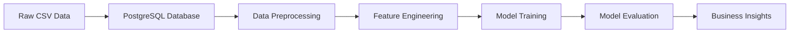

# 📈 Telco Customer Churn Prediction

> **Machine learning project predicting telecom customer churn with 80.9% accuracy using PostgreSQL and Python**

## 🎯 Project Overview

This project predicts which customers are likely to cancel their telecom services, enabling targeted retention strategies. Using a combination of PostgreSQL for data management and Python for machine learning, the model achieves **80.9% accuracy** and **85.3% AUC**, providing actionable insights for business decision-making.

### 🏆 Key Results
- **Dataset:** 7,043 customer records from Kaggle Telco Customer Churn dataset
- **Churn Rate:** 26.54% of customers churned
- **Best Model:** Logistic Regression (80.9% accuracy, 85.3% AUC)
- **Business Impact:** $129,000 potential annual savings through targeted retention

## 🔍 Key Business Insights

| Finding | Impact |
|---------|--------|
| 📋 **Contract Type is #1 predictor** | Month-to-month: 42% churn vs Two-year: 3% churn |
| ⏰ **Tenure matters** | New customers (0-10 months) show highest churn risk |
| 🌐 **Internet Service type** | Fiber optic customers churn more than DSL users |
| 💰 **Monthly Charges** | Higher-paying customers are more likely to churn |

## 🛠 Technology Stack

- **Database:** PostgreSQL 15
- **Languages:** Python 3.11, SQL  
- **ML Libraries:** scikit-learn, pandas, numpy
- **Visualization:** matplotlib, seaborn
- **Environment:** Anaconda

## 📊 Model Performance

### Logistic Regression (Best Model)
```
Accuracy:     80.91%
ROC AUC:      85.26%
Precision:    68% (churn detection)  
Recall:       53% (churn detection)
```

### Business Metrics
- **Customer Lifetime Value:** ~$1,800
- **Retention Cost:** ~$50 per customer  
- **ROI:** 2,600% on targeted retention campaigns

## 🚀 Quick Start

### Prerequisites
- Python 3.11+ with Anaconda
- PostgreSQL 15+
- Git

### Installation

1. **Clone the repository**
```bash
git clone https://github.com/AnthonyMerlinGoHokies/telco-churn-prediction.git
cd telco-churn-prediction
```

2. **Install dependencies**
```bash
pip install -r requirements.txt
```

3. **Set up PostgreSQL database**
```bash
# Create database
createdb telco_churn

# Run setup script
psql -d telco_churn -f sql/create_database.sql
```

4. **Download dataset**
- Get `WA_Fn-UseC_-Telco-Customer-Churn.csv` from [Kaggle](https://www.kaggle.com/datasets/blastchar/telco-customer-churn)
- Place in `data/` folder

5. **Load data and run analysis**
```bash
# Load data into PostgreSQL
python src/load_data.py

# Run complete ML analysis
python src/ml_analysis.py
```

## 📁 Project Structure

```
telco-churn-prediction/
├── 📄 README.md                          # Project overview
├── 📄 requirements.txt                   # Python dependencies
├── 📁 data/                             # Dataset files
│   └── WA_Fn-UseC_-Telco-Customer-Churn.csv
├── 📁 sql/                              # Database setup
│   └── create_database.sql
├── 📁 src/                              # Source code
│   ├── load_data.py                     # Data loading pipeline
│   └── ml_analysis.py                   # ML analysis pipeline
├── 📁 results/                          # Generated outputs
│   ├── eda_analysis.png                 # Exploratory data visualizations
│   ├── model_performance.png            # Model comparison charts
│   └── results_summary.txt              # Complete analysis summary
└── 📁 docs/                             # Additional documentation
```

## 📈 Visualizations

The project automatically generates comprehensive visualizations:


*Charts show churn patterns, contract analysis, model comparisons, and feature importance rankings*

## 💼 Business Applications

1. **🎯 Risk Scoring:** Rank customers by churn probability
2. **📞 Targeted Campaigns:** Focus retention efforts on high-risk customers  
3. **📋 Product Strategy:** Promote long-term contracts to reduce churn
4. **🤝 Customer Success:** Proactive support for new customers

## 🔬 Methodology

1. **Data Engineering:** PostgreSQL database with proper indexing
2. **Feature Engineering:** Created `charges_per_tenure`, `is_new_customer` features
3. **Model Training:** Compared Logistic Regression vs Random Forest
4. **Evaluation:** Used accuracy, ROC AUC, precision, and recall metrics
5. **Business Validation:** Calculated ROI and cost-benefit analysis

## 📊 Dataset Information

- **Source:** [Kaggle Telco Customer Churn Dataset](https://www.kaggle.com/datasets/blastchar/telco-customer-churn)
- **Size:** 7,043 customers with 21 features
- **Target:** Binary classification (Churn: Yes/No)
- **Features:** Demographics, services, contract details, charges

## 🔄 Workflow



## 🚀 Future Enhancements

- [ ] Deploy model as REST API using Flask
- [ ] Create interactive dashboard with Streamlit
- [ ] Add customer segmentation analysis
- [ ] Implement real-time scoring pipeline
- [ ] A/B testing framework for retention strategies

## 🤝 Contributing

1. Fork the repository
2. Create feature branch (`git checkout -b feature/improvement`)
3. Commit changes (`git commit -am 'Add new feature'`)
4. Push to branch (`git push origin feature/improvement`)
5. Create Pull Request

## 📄 License

This project is licensed under the MIT License - see the [LICENSE](LICENSE) file for details.

## 🙏 Acknowledgments

- Dataset provided by IBM Watson Analytics
- Kaggle for hosting the dataset
- PostgreSQL and scikit-learn communities

## 📧 Contact

**Anthony Merlin**
- GitHub: [@AnthonyMerlinGoHokies](https://github.com/AnthonyMerlinGoHokies)
- LinkedIn: [Connect with me](https://linkedin.com/in/yourprofile)

---

⭐ **Star this repository if you found it helpful!**
